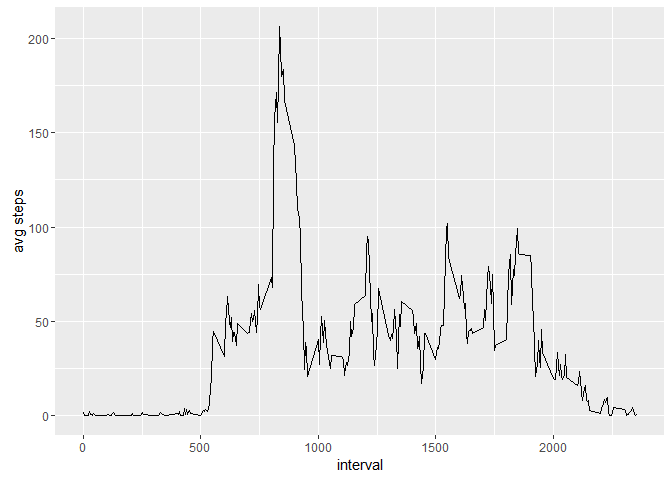
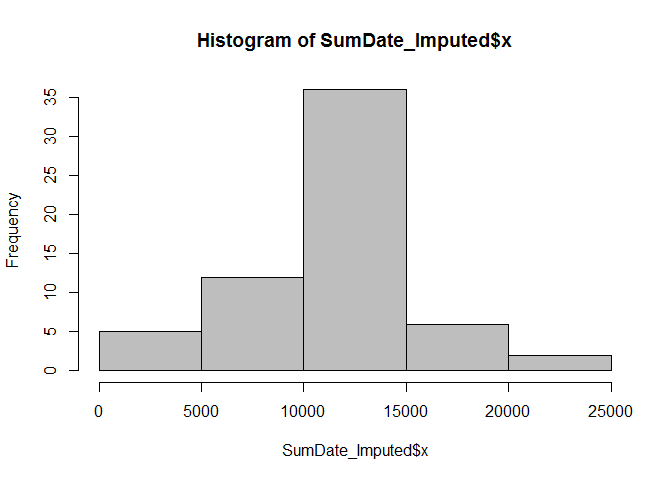
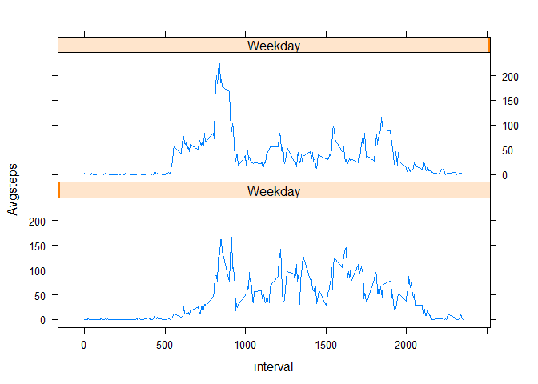

# Reproducible Research: Peer Assessment 1


## Reading the data file, creating subset file with non-missing data 


```r
library(gplots)
```

```
## 
## Attaching package: 'gplots'
```

```
## The following object is masked from 'package:stats':
## 
##     lowess
```

```r
library(caret)
```

```
## Loading required package: lattice
```

```
## Loading required package: ggplot2
```


```r
data = read.csv("activity.csv", header = TRUE)
missing = is.na(data) 
clean.data = subset(data, missing == 'FALSE', select = steps:interval)
```


## summary of cleaned data by day


```r
sum.by.date = aggregate(clean.data$steps, by = list(clean.data$date), FUN = sum)
median(sum.by.date$x)
```

```
## [1] 10765
```

```r
mean(sum.by.date$x)
```

```
## [1] 10766.19
```

## summary of clean data by 5 min interval


```r
meanInterval = aggregate(clean.data$steps, by = list(clean.data$interval), FUN = mean)
qplot(meanInterval$Group.1, meanInterval$x, geom="line", xlab="interval", ylab="avg steps")
```



## Calculating the mean value for Time Interval and imputing it in the missing data set 


```r
test = data
for (i in 1:nrow(test)){
  t1<- test[i,]
  if(is.na(t1$steps) == TRUE){
    t2 = subset(meanInterval, meanInterval$Group.1 == t1$interval)
    test$steps[i]=t2$x
  }
}
```

## Imputing missing data using 5min interval mean data


```r
SumDate_Imputed <- aggregate(test$steps, by = list(test$date), FUN = sum)
hist(SumDate_Imputed$x, col="gray")
```



## Identifying weekday & weekend


```r
test$date <- as.Date(test$date, format = "%Y-%m-%d")
test$weekday <- weekdays(test$date)


for (i in 1:nrow(test)){
    if(test$weekday[i] == "Sunday" || test$weekday[i] == "Saturday" ){
    test$weekend[i] = 1
  }
  else{
    test$weekend[i] = 100
  }
}
```

## Calculating the mean steps for weekday and weeknd and making the Plot 

```r
join <- aggregate(test$steps,by = list(test$interval, test$weekend), FUN = mean)
colnames(join) = c("interval","Weekday","Avgsteps")
xyplot(Avgsteps ~ interval| Weekday, data=join, layout =c(1,2),type='l')
```


